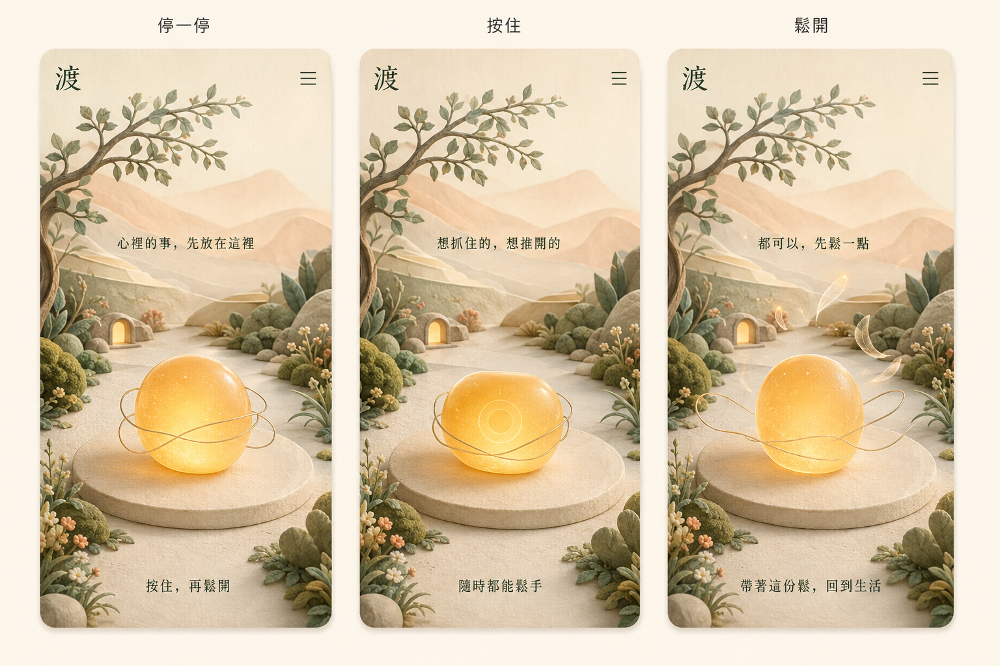

# 《渡》全面重設計：一盞心燈

日期：2026-09-07。這份方案承接主公「畫風與內容都可以全改」及後續確認。主畫面、按放、輕點操作、《回暖》配樂、安裝與更新入口已實作；原版本保存為 legacy.html，透過功能頁回看。以下保留設計依據與後續手機驗證項目。

## 體驗的核心

「想抓住的，想推開的，都可以先鬆一點。」

玩家帶著自己當下心裡的事進來，用拇指按住一盞柔光，再鬆手。光外面的細線舒展，光仍在。這個短動作是生活中的提醒；玩家自己體會有沒有變化，程式不替人判定已放下。

《渡》的名字保留。對外副標採用「讓心，鬆一點」。設計概念名「一盞心燈」用於製作討論，介面不額外堆放名詞。

## 全新的畫面

畫風：紙雕層次、霧面陶土、手繪粉彩混合的小庭園。圓潤而細膩，讓成年人也願意打開。樹葉有疏密，石台有觸感，遠景有空氣，中心保留可辨識的單一互動物。

配色：暖米白 #F4EBDD、鼠尾草綠 #899C83、蜜桃 #E8B39D、蜂蜜金 #E2AE63、深褐字色 #3D453B。文字實作需依所在底圖確認對比，不把細淡字直接壓在明暗交錯的景物上。

景物：遠處柔和丘陵，中景一棵伸展的樹與小小園門，近景圓石台、苔與少量草花。主角是一顆透出暖光、像柔軟琥珀石的「心燈」，放在畫面下半部。兩三條細絲環繞它。

沒有擬人導師、角色對話或必須照顧的寵物。景物從一開始就完整，花草不以按放次數生長，按住時景色也不變壞。

直式構圖以 390 × 844 為設計基準：頂部安全區後放「渡」與功能鍵；上方至中段呈現庭園景深；下半部約 62–72% 高度放心燈；底部放一行操作提示。實作須適應 320px 寬與較短螢幕，按放區保持在拇指容易碰到的位置，隨可用高度調整，不能只寫死百分比。

右上功能鍵維持明確 48px 觸控範圍，收納聲音、安裝手機 App、更新與簡短說明。主畫面不放導航列或卡片列表。

## 一次操作

1. 打開：庭園已經在。主提示「心裡的事，先放在這裡」，心燈下方「按住，再鬆開」。不要求寫下願望，也不要求搜尋痛苦回憶。
2. 按住：100ms 內看到光團輕輕內收，細絲稍微聚攏。可顯示「想抓住的，想推開的」。下方提示「隨時都能鬆手」。到達小幅收縮後保持，不累積能量、不越按越緊。
3. 鬆手：立即回彈，細絲往兩側舒展並淡去約 0.8–1.2 秒，光保留在原處。可顯示「都可以，先鬆一點」。這是觸控回饋，並非放下成功的判定。
4. 留白：光慢慢回到自然形狀，可短暫出現「帶著這份鬆，回到生活」。使用者可以立即再按或離開，沒有等候或過關。

整個體驗隨時可結束。短按、長按都能操作，不需要按到某個秒數。放開後即刻再按時，動畫從當前形狀平順接續，不排隊播放、不鎖住手指。

第一回提示完整，後續預設縮成「按住，再鬆開」，不自動更換長篇文字。可在功能鍵內重看操作說明。

## 內容的份量

內容以主流程三句為主，不加每次必看的情境故事。補充句只供使用者主動開啟「一句提醒」時閱讀；每次顯示一句，用同一個位置，關閉後記住偏好。

原創提醒候選：

- 「心裡的事，先放在這裡。」
- 「想抓住的，想推開的，都可以先鬆一點。」
- 「還放不下，也不用逼自己。」
- 「心裡還有感覺，也可以。」
- 「願望可以留著，手先鬆開。」
- 「回到眼前，做現在能做的事。」

這些都是本遊戲的改寫文案，不能署名為萊斯特原話。不把要求玩家『立刻愛所有人』做成關卡，也不暗示遭遇不順是玩家沒有放好。

## 心法如何進入設計

參考的是萊斯特相關文本裡，對向外索求、想控制結果與內在自由的討論。按放是我們設計的入口，不宣稱一個動作等同完整方法。

六步驟作為內部核對：重視自由；願意嘗試釋放；辨認感受背後的索求；融入日常；卡住時也能放下控制卡住狀態的衝動；留意自己的實際體驗。不同教材版本的用語有差異，正式說明引用下列教材版本，不拼湊成所謂唯一原版。畫面不做成六道關卡。

關鍵設計取捨：

- 用鬆開細絲表達鬆動抓取與排斥；光不被消滅，事情也不被丟棄。
- 開始與結束都是同一個庭園；不靠大爆光、變富有或許願獎勵來表示心法有效。
- 覺察與善意用邀請式短句表達，不替使用者分析或評價。
- 回到生活是出口。使用者自然想起這個動作，即使不用再打開 App，也符合本案目的。

願望可以作為內心方向，遊戲不承諾某個外在結果必然發生。文案不把人的責任、界線與實際行動交給動畫處理。

參考資料：

- [Release Technique：Lester Levenson's story（20 頁故事版）](https://www.releasetechnique.com/pdf/LesterLevensonStory.pdf)，本次已讀全文；不是完整自傳。相關段落見 PDF 第 5–9、15–17 頁。
- [The Sedona Method Course workbook](https://s3.amazonaws.com/Sedona.Method/sedona-method-workbook2.pdf)，PDF 第 70 頁（書頁 71）The Six Steps；願望、依附與排斥的討論見 PDF 第 79 頁。

## 聲音與觸感

依主公後續要求，配樂改為原創試聽曲《回暖》：柔和擊弦音色、低音分解和弦與有呼應的五段短旋律。琴音從輕起音自然衰減，句尾保留空隙。旋律圍繞 F 大調五聲音階，音色以合成弦的泛音塑形；不是實錄古琴。

試聽檔：designs/heartlight-warm-strings-v2.wav，60 秒立體聲。生成腳本：designs/render-heartlight-music.py。本段用於判斷旋律與音色，尾部有淡出，尚未製成無縫循環母帶。

持續水聲關閉，不靠持續風噪填滿空間。按住不加上升蓄力音，放開只留極輕的暖音尾韻；密集操作時限制重疊，避免越按越吵。保留既有靜音與音量偏好。主公確認後，配樂已編碼為 music/heartlight-warm-strings.mp3 並接入新首頁；循環時保留樂句結束的自然留白。

手感靠視覺收攏與舒展成立，震動不列為必要效果。手機瀏覽器能否震動不應影響核心體驗。

## 留住人的理由

第一次吸引力來自畫面與柔軟手感；再打開的理由是『現在心有點緊，想鬆一下』。可依本機時段出現晨光、午後、夜色，所有時段的畫面都完整可看，與連續登入或累積操作無關。

沒有日課、倒數、連續天數、分數、蒐集、解鎖、通知。實際是否願意使用，需要先讓人摸到原型；漂亮概念圖不能證明好玩或有生活上的幫助。

## 製作與驗證

先做同一庭園、同一心燈的按放原型。背景做成壓縮點陣圖，心燈與細絲分離成可動圖層，文字與功能鍵保持真實 HTML，不能把概念圖整張當可操作介面。動態以 transform / opacity 為主，離開畫面即暫停；減少動態模式用淡化取代舒展。

需處理手指滑出、pointercancel、多指、切到背景與立刻重按；皆不能卡在按壓狀態。提供單次點按的等效模式，以及鍵盤操作，讓不便長按的人也能使用。

保留免費公開、免帳號、離線可用與手機安裝。舊存檔 du_ferry_save_v1、聲音設定 du_ferry_sound 與 du_ferry_audio_v2 不清除；舊內容可由功能頁中的舊版入口回看，並與新主流程分開載入。更新沿用既有 PWA 更新機制，發佈時另核對快取版本與冷啟動。

先驗證三件事：第一次打開是否知道如何碰；鬆手是否立即且舒服；結束後是否自然想到自己眼前的一件事。允許試玩者說沒有感覺，不要求完成心得表單。

## 視覺稿

由內建 image_gen 產生三個直式狀態的原創概念圖：停一停、按住、鬆開。圖像用於確認美術與版面方向；實作字體、對比、觸控區與動畫仍須在實際手機驗證。

最終提示詞及檢視紀錄：designs/heartlight-image-prompt.md。此圖已確認主文字、直式構圖及三態差異，尚未代表按放手感通過手機實測。
